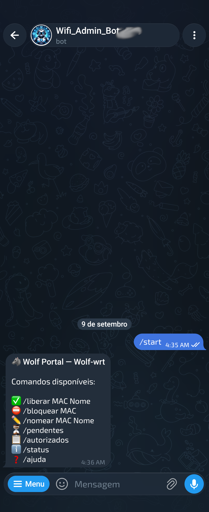
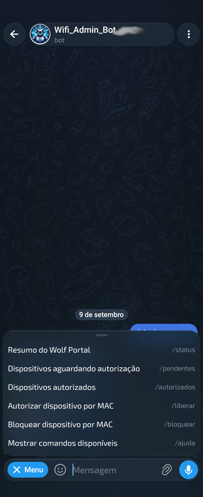
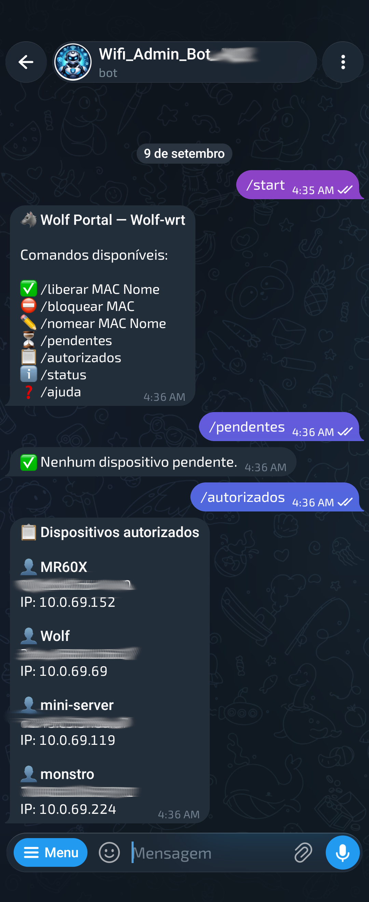
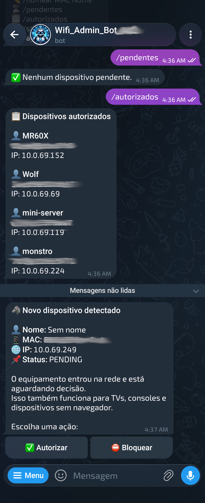
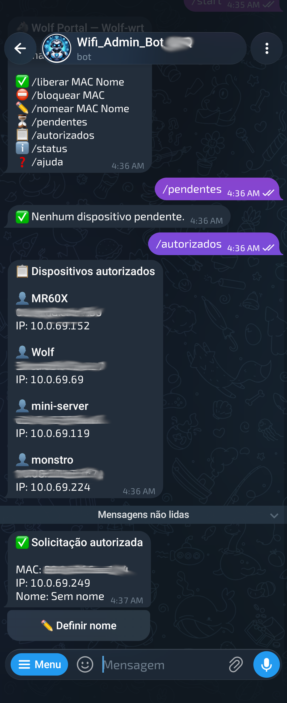
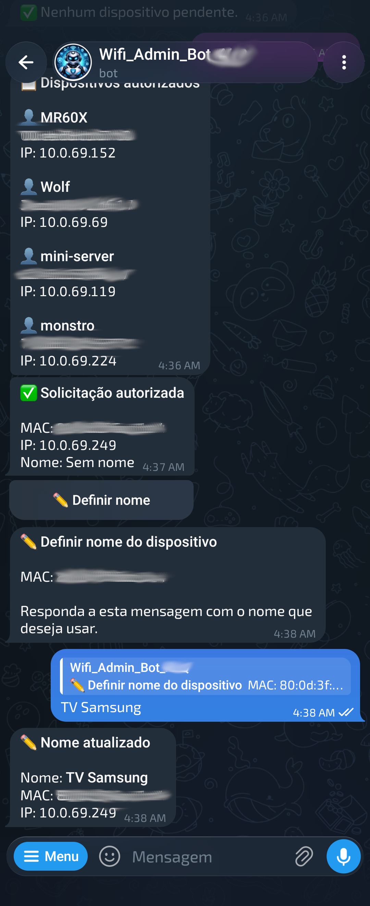
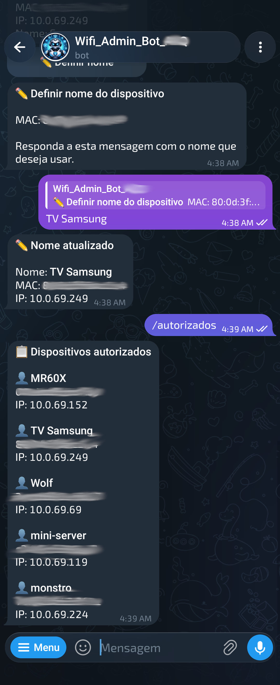
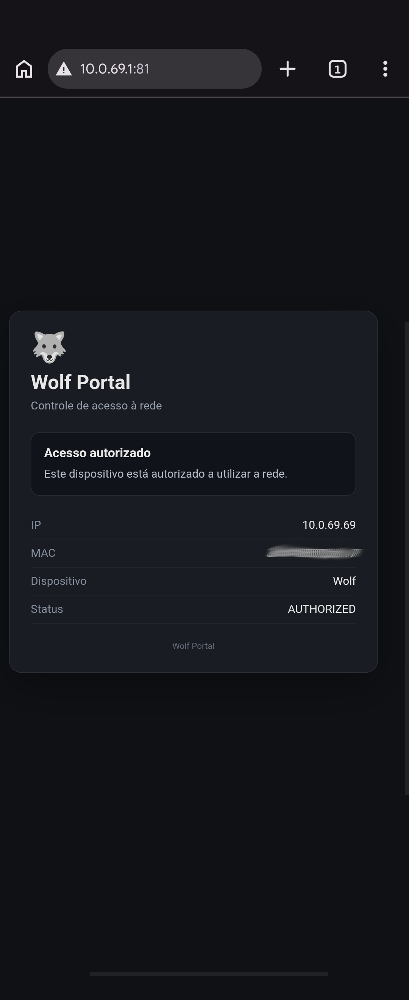

# 🐺 Wolf Portal

Portal cativo e sistema de controle de acesso à rede para OpenWrt, integrado ao `firewall4`/`nftables`, com descoberta automática de dispositivos, autorização via Telegram e página web para solicitação de acesso.

O Wolf Portal foi desenvolvido para substituir uma implementação anterior baseada em openNDS, mantendo o controle diretamente sobre o firewall do OpenWrt.

## Recursos

* descoberta automática de dispositivos conectados à LAN;

* cadastro automático de novos dispositivos como `PENDING`;

* bloqueio de Internet para dispositivos não autorizados;

* redirecionamento de tráfego HTTP para o portal cativo;

* página de solicitação de acesso;

* suporte à detecção automática de captive portal do Android e outros dispositivos;

* notificação de novos dispositivos via Telegram;

* autorização ou bloqueio diretamente pelo Telegram;

* nomeação de dispositivos;

* suporte a TVs, consoles e equipamentos sem navegador;

* banco SQLite persistente;

* integração com `firewall4` e `nftables`;

* serviço supervisionado pelo `procd`;

* reinicialização automática dos componentes em caso de falha;

* proteção administrativa por MAC;

* mecanismo de rollback para alterações de firewall;

* preservação dos dados durante `sysupgrade`.

---

# Demonstração

As capturas abaixo mostram o fluxo real do Wolf Portal em funcionamento.

## Bot do Telegram

Ao iniciar a conversa com o bot, o administrador recebe os principais comandos disponíveis para gerenciamento da rede.

<p align="center">
  
  &nbsp;&nbsp;
  
</p>

## Dispositivos autorizados

O comando `/autorizados` mostra os equipamentos liberados e os dados conhecidos pelo Wolf Portal.

<p align="center">
  
</p>

## Detecção automática de dispositivos

Quando um equipamento desconhecido entra na rede, ele é cadastrado como `PENDING`, perde o acesso à Internet e gera uma notificação automática no Telegram.

<p align="center">
  
</p>

A notificação permite autorizar ou bloquear o equipamento diretamente. Isso também atende TVs, consoles e dispositivos IoT que não possuem navegador.

## Autorização

Quando o administrador autoriza o equipamento, o banco é atualizado e o firewall é sincronizado imediatamente.

<p align="center">
  
</p>

## Nomeação

Após a autorização, o dispositivo pode receber um nome amigável pelo próprio Telegram.

<p align="center">
  
</p>

A listagem de autorizados passa então a exibir o novo nome.

<p align="center">
  
</p>

## Portal web

O portal apresenta ao cliente o estado de acesso e os dados conhecidos pelo sistema.

<p align="center">
  
</p>

---

# Arquitetura

O sistema é dividido em três processos principais:

```text
                    ┌────────────────────┐
                    │      OpenWrt       │
                    └─────────┬──────────┘
                              │
                ┌─────────────┼─────────────┐
                │             │             │
                ▼             ▼             ▼
        ┌──────────────┐ ┌───────────┐ ┌──────────────┐
        │   Monitor    │ │  Portal   │ │   Telegram   │
        │   de rede    │ │   HTTP    │ │     Bot      │
        └──────┬───────┘ └─────┬─────┘ └──────┬───────┘
               │               │              │
               └───────────────┼──────────────┘
                               ▼
                       ┌──────────────┐
                       │    SQLite    │
                       │ fonte da     │
                       │ verdade      │
                       └──────┬───────┘
                              │
                              ▼
                     ┌─────────────────┐
                     │ firewall4 / nft │
                     └─────────────────┘
```

O banco SQLite é considerado a fonte da verdade para o estado dos dispositivos.

---

# Estados dos dispositivos

Cada dispositivo pode estar em um dos seguintes estados:

| Estado       | Comportamento                        |

| ------------ | ------------------------------------ |

| `PENDING`    | Sem Internet, aguardando autorização |

| `AUTHORIZED` | Acesso liberado                      |

| `BLOCKED`    | Acesso explicitamente bloqueado      |

| `DISABLED`   | Dispositivo desativado               |

Novos dispositivos são sempre cadastrados como:

```text
PENDING
```

Nunca são autorizados automaticamente.

---

# Fluxo de um dispositivo novo

```text
Dispositivo entra na rede
        ↓
NetworkMonitor detecta o MAC
        ↓
DeviceDiscovery cadastra o dispositivo
        ↓
Status = PENDING
        ↓
Firewall é sincronizado
        ↓
Internet é bloqueada
        ↓
Telegram informa o administrador
        ↓
HTTP é redirecionado para o Wolf Portal
        ↓
Usuário pode solicitar acesso
        ↓
Administrador autoriza pelo Telegram
        ↓
Status = AUTHORIZED
        ↓
Firewall é reconstruído
        ↓
Internet é liberada
```

Dispositivos sem navegador, como TVs, consoles e equipamentos IoT, ainda podem ser autorizados diretamente pela notificação recebida no Telegram.

---

# Firewall

O Wolf Portal integra suas regras diretamente à tabela:

```text
inet fw4
```

através do include:

```text
/etc/nftables.d/90-wolf-portal.nft
```

Ele cria somente objetos próprios:

```text
wolf_portal_prerouting
wolf_portal_input
wolf_portal_forward
wolf_portal_failsafe_macs
wolf_portal_authorized_macs
wolf_portal_blocked_macs
```

O sistema não:

* remove `table inet fw4`;

* executa `flush ruleset`;

* altera as chains nativas `input`, `forward` ou `output`;

* utiliza `policy drop`;

* bloqueia genericamente toda a LAN.

A política é deliberadamente **fail-open**.

Somente MACs explicitamente presentes em:

```text
wolf_portal_blocked_macs
```

recebem `DROP`.

---

# Proteção administrativa

Existe um MAC administrativo protegido definido no código:

```python
PROTECTED_ADMIN_MAC = "70:08:10:b3:3f:71"
```

Esse dispositivo nunca pode ser adicionado ao conjunto de bloqueados.

Antes de instalar o projeto em outro ambiente, altere esse valor em:

```text
app/firewall_manager.py
```

para o MAC do computador administrativo que deve permanecer protegido.

---

# Captive Portal

O portal HTTP é executado na porta:

```text
81
```

e normalmente fica disponível em:

```text
http://status.client:81/
```

O instalador configura o `dnsmasq` para resolver:

```text
status.client
```

para o IPv4 da interface LAN.

Tráfego HTTP de dispositivos bloqueados é interceptado por uma chain NAT:

```text
wolf_portal_prerouting
```

e redirecionado para a porta `81`.

HTTPS não é interceptado.

---

# Estrutura do projeto

```text
wolf-portal/
├── app/
│   ├── access_controller.py
│   ├── access_policy.py
│   ├── database.py
│   ├── device_access_service.py
│   ├── device_discovery.py
│   ├── device_manager.py
│   ├── discovery_cycle.py
│   ├── firewall_manager.py
│   ├── firewall_sync.py
│   ├── main.py
│   ├── models.py
│   ├── monitor_service.py
│   ├── network_monitor.py
│   ├── nftables_controller.py
│   ├── nftables_executor.py
│   ├── nftables_rules.py
│   ├── portal_server.py
│   ├── portal_service.py
│   ├── presence_manager.py
│   └── telegram_bot.py
├── config/
│   └── telegram.conf.example
├── data/
│   └── .gitkeep
├── docs/
│   └── images/
│       ├── 01-portal-autorizado.png
│       ├── 02-telegram-inicio.png
│       ├── 03-telegram-menu.png
│       ├── 04-dispositivos-autorizados.png
│       ├── 05-novo-dispositivo-detectado.png
│       ├── 06-solicitacao-autorizada.png
│       ├── 07-nomeacao-dispositivo.png
│       └── 08-lista-autorizados-atualizada.png
├── openwrt/
│   └── wolf-portal.init
├── tests/
│   ├── manual/
│   └── test_*.py
├── tools/
│   ├── dhcp_importer.py
│   └── rebuild_clean_database.py
├── .gitignore
├── LICENSE
├── README.md
├── install.sh
└── uninstall.sh
```

---

# Requisitos

O projeto foi desenvolvido e validado em OpenWrt 25.12.

Principais dependências:

* Python 3;

* SQLite para Python;

* `urllib`;

* SSL/OpenSSL para Python;

* `nftables`;

* `firewall4`;

* comando `ip`;

* `dnsmasq`;

* `uci`;

* `procd`.

O instalador tenta instalar automaticamente dependências ausentes.

OpenWrt 25.12+ utiliza `apk`.

Versões anteriores com `opkg` também são suportadas pelo instalador.

---

# Instalação

Clone ou copie o repositório para o OpenWrt.

Exemplo, executando como `root`:

```sh
cd /root
git clone https://github.com/WagnerWolf/wolf-portal.git
cd wolf-portal
```

Torne o instalador executável:

```sh
chmod +x install.sh
```

Execute:

```sh
./install.sh
```

O instalador:

1. verifica o ambiente;
2. instala dependências ausentes;
3. copia a aplicação para `/usr/lib/wolf-portal`;
4. cria a área persistente em `/etc/wolf-portal`;
5. inicializa o banco SQLite;
6. configura `status.client` no `dnsmasq`;
7. remove configurações antigas de captive portal conhecidas;
8. instala o serviço `procd`;
9. adiciona `/etc/wolf-portal/` ao `sysupgrade.conf`;
10. valida o `firewall4`;
11. habilita o Wolf Portal no boot;
12. inicia os serviços;
13. executa um healthcheck.

Após a instalação, o clone usado apenas para instalar pode ser removido. O serviço passa a executar o código instalado em `/usr/lib/wolf-portal` e mantém os dados persistentes em `/etc/wolf-portal`.

---

# Caminhos utilizados na instalação

Código:

```text
/usr/lib/wolf-portal/
```

Configuração:

```text
/etc/wolf-portal/
```

Banco:

```text
/etc/wolf-portal/data/wolf-portal.db
```

Estado do Telegram:

```text
/etc/wolf-portal/data/telegram-bot-state.json
```

Configuração Telegram:

```text
/etc/wolf-portal/telegram.conf
```

Serviço:

```text
/etc/init.d/wolf-portal
```

Include nftables:

```text
/etc/nftables.d/90-wolf-portal.nft
```

---

# Configuração do Telegram

Copie o modelo:

```sh
cp config/telegram.conf.example /etc/wolf-portal/telegram.conf
```

Edite:

```text
TOKEN="TOKEN_DO_BOT"
ADMIN_ID="ID_DO_ADMINISTRADOR"
```

Proteja o arquivo:

```sh
chmod 600 /etc/wolf-portal/telegram.conf
```

Reinicie o serviço:

```sh
/etc/init.d/wolf-portal restart
```
---

# Comandos do Telegram

O menu do bot é configurado automaticamente através da API do Telegram.

Entre os comandos disponíveis estão funções como:

```text
/status
/pendentes
/autorizados
/liberar
/nomear
/bloquear
```

Novos dispositivos também geram notificações automáticas com botões de ação.

A interface atual do bot permite autorizar, bloquear e nomear dispositivos sem precisar acessar o roteador via SSH.

---

# Serviço OpenWrt

Status:

```sh
ubus call service list '{"name":"wolf-portal"}'
```

Iniciar:

```sh
/etc/init.d/wolf-portal start
```

Parar:

```sh
/etc/init.d/wolf-portal stop
```

Reiniciar:

```sh
/etc/init.d/wolf-portal restart
```

Habilitar no boot:

```sh
/etc/init.d/wolf-portal enable
```

Desabilitar no boot:

```sh
/etc/init.d/wolf-portal disable
```

O serviço contém três instâncias `procd`:

```text
monitor
portal
telegram
```

---

# Logs

As instâncias Python utilizam saída sem buffering e são encaminhadas ao `logd`.

Para acompanhar:

```sh
logread -f | grep python3
```

ou:

```sh
logread | grep -E 'python3|wolf-portal'
```

Exemplos de mensagens:

```text
WOLF PORTAL - INICIALIZAÇÃO
Firewall sincronizado com sucesso.
WOLF PORTAL - MONITORAMENTO ATIVO
WOLF PORTAL - SERVIDOR HTTP
Wolf Portal Telegram Bot iniciado
```

---

# Healthcheck

Local:

```sh
curl http://127.0.0.1:81/health
```

Resposta esperada:

```json
{
  "status": "ok",
  "service": "wolf-portal"
}
```

---

# Verificação do firewall

Chains:

```sh
nft list chain inet fw4 wolf_portal_prerouting
nft list chain inet fw4 wolf_portal_input
nft list chain inet fw4 wolf_portal_forward
```

Dispositivos autorizados:

```sh
nft list set inet fw4 wolf_portal_authorized_macs
```

Dispositivos bloqueados:

```sh
nft list set inet fw4 wolf_portal_blocked_macs
```

Validação completa do firewall:

```sh
fw4 check
```

---

# Banco de dados

O Wolf Portal utiliza SQLite.

O banco persistente fica em:

```text
/etc/wolf-portal/data/wolf-portal.db
```

Principais tabelas:

```text
devices
events
```

O banco é considerado a fonte da verdade.

Sempre que um status é alterado:

```text
Banco
  ↓
FirewallManager
  ↓
NftablesRules
  ↓
NftablesExecutor
  ↓
firewall4
```

---

# Backup

Exemplo:

```sh
cp -a \
    /etc/wolf-portal \
    /root/wolf-portal-backup
```

Como `/etc/wolf-portal/` está registrado em:

```text
/etc/sysupgrade.conf
```

essa área também deve ser preservada durante upgrades normais do OpenWrt.

---

# Reconstrução limpa do banco

A ferramenta:

```text
tools/rebuild_clean_database.py
```

permite recriar um banco do zero mantendo dispositivos selecionados e reiniciando a sequência dos IDs.

Exemplo de dry-run:

```sh
PYTHONPATH=. python3 \
    tools/rebuild_clean_database.py \
    --exclude-mac 40:ff:a1:20:eb:92
```

Aplicação real:

```sh
/etc/init.d/wolf-portal stop
PYTHONPATH=. python3 \
    tools/rebuild_clean_database.py \
    --exclude-mac 40:ff:a1:20:eb:92 \
    --apply
/etc/init.d/wolf-portal start
```

A ferramenta cria backup antes da substituição do banco.

---

# Importação de dispositivos

`tools/dhcp_importer.py` existe como ferramenta de migração para instalações antigas que possuíam dispositivos cadastrados através do DHCP/OpenWrt.

Ela não participa do funcionamento normal do serviço.

---

# Testes

Os testes automáticos ficam diretamente em:

```text
tests/
```

Os testes que podem tocar no firewall real foram separados em:

```text
tests/manual/
```

Isso evita execução acidental de testes destrutivos.

## Executar todos os testes automáticos

```sh
FAILED=0
for f in $(find tests -maxdepth 1 -type f -name 'test_*.py' | sort); do
    echo
    echo "=============================================="
    echo " $f"
    echo "=============================================="
    PYTHONPATH=. python3 "$f" || {
        FAILED=1
        break
    }
done
if [ "$FAILED" -eq 0 ]; then
    echo "TODOS OS TESTES PASSARAM"
else
    echo "ALGUM TESTE FALHOU"
fi
```

Os testes automáticos não entram em:

```text
tests/manual/
```

---

# Testes manuais

Os arquivos em:

```text
tests/manual/
```

podem modificar temporariamente o firewall real e devem ser executados somente em ambiente controlado.

Alguns utilizam rollback automático para reduzir o risco de perda de acesso administrativo.

Leia o código antes de executá-los.

---

# Atualização do Wolf Portal

Com o repositório atualizado:

```sh
git pull
./install.sh
```

O instalador é idempotente.

Uma instalação existente é parada, o código é atualizado e os dados persistentes em:

```text
/etc/wolf-portal/
```

são preservados.

---

# Desinstalação

Desinstalação preservando banco e configuração:

```sh
./uninstall.sh
```

São removidos:

* serviço `procd`;

* código instalado;

* regras nftables;

* include do Wolf Portal;

* entrada DNS `status.client`.

São preservados:

```text
/etc/wolf-portal/
```

Isso permite reinstalar posteriormente sem perder os dispositivos cadastrados.

---

# Desinstalação completa

Para apagar também banco, estado e configuração:

```sh
./uninstall.sh --purge
```

Use com cuidado.

---

# Segurança

Alguns princípios usados pelo projeto:

* novos dispositivos nunca são autorizados automaticamente;

* banco SQLite é a fonte da verdade;

* somente MACs explicitamente bloqueados recebem `DROP`;

* não é utilizada `policy drop`;

* o Wolf Portal não remove a tabela `inet fw4`;

* regras nativas do firewall4 não são sobrescritas;

* existe um MAC administrativo protegido;

* mudanças críticas de firewall possuem validação antes da aplicação;

* existe suporte a rollback automático em operações de teste;

* token do Telegram fica fora do código;

* configuração sensível usa permissão `0600`;

* o portal público não aceita MAC informado pelo navegador;

* o MAC é identificado pelo próprio roteador a partir do IP e da tabela de vizinhos.

---

# Limitações atuais

* a interceptação automática é feita para HTTP;

* HTTPS não pode ser transparentemente redirecionado sem provocar erros de certificado;

* identificação depende da tabela de vizinhos do kernel;

* o portal atualmente assume a interface LAN `br-lan`;

* o domínio interno padrão é `status.client`;

* o portal utiliza a porta `81`;

* existe um único administrador Telegram configurado;

* o MAC administrativo protegido está definido no código e deve ser personalizado para outras instalações.

---

# Desenvolvimento

A implementação evita dependências Python externas sempre que possível.

São utilizadas principalmente bibliotecas da própria linguagem:

```text
sqlite3
urllib
http.server
threading
dataclasses
enum
json
```

Isso reduz o número de pacotes necessários em dispositivos OpenWrt com recursos limitados.

---

# Status do projeto

O fluxo completo foi validado em hardware real:

```text
novo dispositivo
    ↓
detecção automática
    ↓
PENDING
    ↓
bloqueio de Internet
    ↓
notificação Telegram
    ↓
detecção de captive portal
    ↓
redirecionamento HTTP
    ↓
solicitação de acesso
    ↓
autorização pelo Telegram
    ↓
nomeação
    ↓
sincronização do firewall
    ↓
Internet liberada
```

Também foram validados:

* inicialização após reboot;

* supervisão pelo `procd`;

* reinstalação sobre instalação existente;

* desinstalação preservando dados;

* reinstalação reutilizando os dados preservados;

* restauração do firewall;

* resolução de `status.client`;

* persistência do banco;

* suíte completa de testes automáticos.

---

# Licença

Este projeto é distribuído sob a licença **GNU General Public License v3.0 only (GPL-3.0-only)**.

Você pode usar, estudar, modificar e redistribuir este software de acordo com os termos da GNU GPL versão 3.

Modificações e trabalhos derivados distribuídos a terceiros também devem manter a mesma licença e disponibilizar o respectivo código-fonte.

Consulte o arquivo [`LICENSE`](LICENSE) para os termos completos.

---

# Autor

**Wagner Wolf**

Wolf Portal — controle de acesso à rede para OpenWrt.
